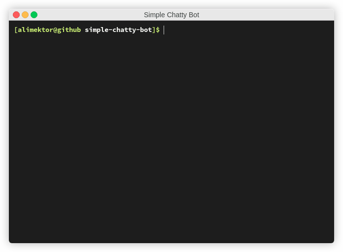

## Description ##

In this project, we will develop step by step a simple bot.

**Just read the code**.

## Objective ##

### Step 1 ###

> Implement the `Bot` class with the `greet()` method.

For the first step, we will write a bot who displays a greeting, its name, and the date of its creation.

The program should print the following lines:

```txt
Hello! My name is {bot_name}.
I was created in {birth_year}.
```

> Instead of `{bot_name}`, print any name choose and replace `{birth_year}` with the current year (four digits).

### Step 2 ###

> Implement the `remind_name()` method.

At this step, we will introduce ourself to the bot so that it can greet us by our name.

The program should print the following lines:

```txt
Hello! My name is Aid.
I was created in 2020.
Please, remind me your name.
What a great name you have, {your_name}!
You may change the name and the creation year of your bot if you want.
```

> Instead of `{your_name}`, the bot must print the name entered from the standard input.

### Step 3 ###

> Implement the `guess_age()` method.

The program will greet us by the name and then try to guess the age using arithmetic operations.

The program should print the following lines:

```txt
Hello! My name is Aid.
I was created in 2020.
Please, remind me your name.
What a great name you have, Max!
Let me guess your age.
Enter remainders of dividing your age by 3, 5 and 7.
Your age is {your_age}; that's a good time to start programming!
```

Read three numbers from the standard input. Assume that all the numbers will be given on separate lines.

> Instead of `{your_age}`, the bot will print the age determined according to the special formula.

### Step 4 ###

At this Step, we will program the bot to count from 0 to any positive number users enter.

> Implement the `count()` method.

> Note: each number starts with a new line, and after a number, the bot should print the exclamation mark.

Use the provided template to simplify your work.

### Step 5 ###

> Implement the `test()` method.

> Implement the `end()` method.

The bot can ask anything you want, but there are two rules for the output:

- the line with the test should end with the question mark character;
- an option starts with a digit followed by the dot (1., 2., 3., 4.)

If a user enters an incorrect answer, the bot may print a message:

```txt
Please, try again.
```

The program should stop on the correct answer and print `Congratulations, have a nice day!` at the end.

## Examples ##

### Example 1

```txt
Hello! My name is Aid.
I was created in 2020.
Please, remind me your name.
> Max
What a great name you have, Max!
```

### Example 2 ###

```txt
Hello! My name is Aid.
I was created in 2020.
Please, remind me your name.
> Max
What a great name you have, Max!
Let me guess your age.
Enter remainders of dividing your age by 3, 5 and 7.
> 1
> 2
> 1
Your age is 22; that's a good time to start programming!
```

### Example 3 ###

```txt
Hello! My name is Aid.
I was created in 2020.
Please, remind me your name.
> Alimektor
What a great name you have, Alimektor!
Let me guess your age.
Enter remainders of dividing your age by 3, 5 and 7.
> 7
> 2
> 1
Your age is 22; that's a good time to start programming!
Now I will prove to you that I can count to any number you want.
> 5
0!
1!
2!
3!
4!
5!
Completed, have a nice day!
```

## Tests ##

You have test methods in this directory in the `tests` folder. Use them to pass the assignment.

You can use the following command to launch the tests:

```bash
pytest tests/
```
